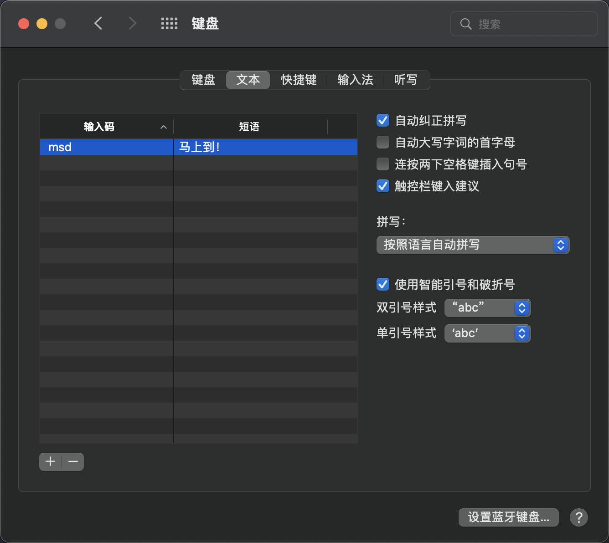

### MAC 避免连按两下空格键插入句号

操作步骤如下：
> 1.打开系统偏好设置  
> 2.点击键盘  
> 3.点击文本  
> 4.取消勾选「连按两下空格键插入句号」

### MAC 避免自动大写首字母

操作步骤如下：
> 1.打开系统偏好设置  
> 2.点击键盘  
> 3.点击文本  
> 4.取消勾选「自动大写字词的首字母」  

(PS：经测试，文件编辑软件会有该问题)

